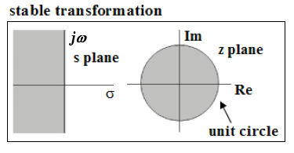

## Introduction

<b>Discipline | <b>Electrical Engineering 
:--|:--|
<b> Lab | <b> Digital Control Laboratory
<b> Experiment|     <b> Mapping of S-plane to Z-plane analytically and verification using simulation and Exp 2

### About the Experiment 

The absolute stability and relative stability of the linear time-invariant continuous time closed-loop control system are determined by the location of the closed-loop poles in the s plane.
For example, complex closed-loop poles in the left half of the s plane near the j&omega; axis will exhibits oscillatory behavior, and closed-loop poles on the negative real axis will exhibit exponential decay.

Since the complex variables z and s are related by z = e Ts , the pole and zero locations in the z plane are related to the pole and zero locations in the s plane.
Therefore, the stability of the linear time-invariant discrete-time closed-loop system can be determined in terms of the locations of the poles of the closed-loop pulse transfer function.
It is noted that the dynamic behavior of the discrete-time control system depends on the sampling period T. In other words, a change in the sampling period T modifies the pole and zero locations in the z plane and causes the response behavior to change.

In the design of a continuous-time control system, the locations of the poles and zeros in the s plane are very important in predicting the dynamic behavior of the system.
Similarly, in designing discrete-time control systems, the locations of the poles and zeros in the z plane are very important. Figure 1 shows the stable region in the s plane and its transformation into the z plane.

<figcaption style="color:black"> Fig.1. Mapping the stable region of s plane into z plane </figcaption>

In this experiment, we shall investigate how the locations of the poles and zeros in the s plane compare with the locations of the poles and zeros in the z plane.
		

	

<b>Subject matter expertise | <b> **Prof. Alok Kanti Deb**
:--|:--|
<b> Institute | <b>  **Indian Institute of Technology Kharagpur**
<b> Email id|     <b>  **alokkanti@ee.iitkgp.ac.in**
<b> Department |  **Department of Electrical Engineering**
<b>Webpage| <b> http://www.iitkgp.ac.in/department/EE/faculty/ee-alokkanti

### Contributors List

SrNo | Name | VLabs Developer or Integration Engineer | Designation | Department| Institute
:--|:--|:--|:--|:--|:--|
1 | **Kamal Sandeep Karreddula** | Developer | Research Scholar | Department of Electrical Engineering | IIT Kharagpur | 
2 | **Piyali Chattopadhyay** | Integration Engineer | Project Scientist | Department of Mechanical Engineering | IIT Kharagpur |

