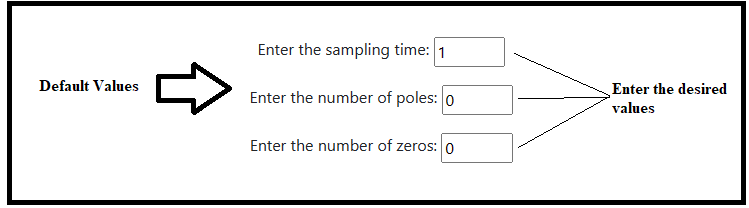
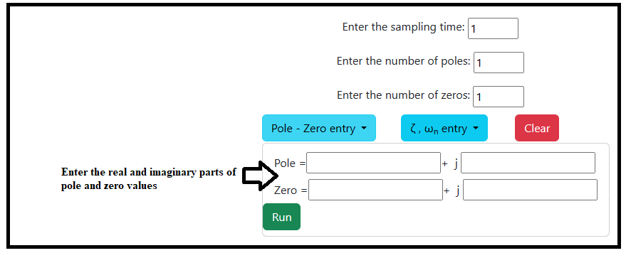
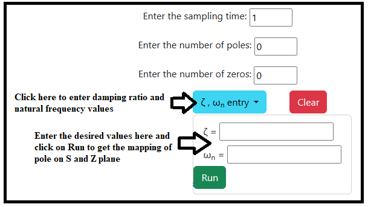

### Procedure

<b>Steps to perform the simulation</b>

1. At first enter the desired value of sampling time. Here default value is 1 for sampling time.

2. Enter the required number of poles and zeros value. Here default values are 0 for number of poles and zeros.

<figcaption style="color:black"> Fig.1. Entry of Sampling time, number of poles and zeros</figcaption>						  

3. Click on 'Pole - Zero entry' dropdown-menu and enter the real and imaginary values of pole and zero.
Click on 'Run' button in the dropdown-menu to get the Pole Zero Map of S plane and Z plane.

<figcaption style="color:black"> Fig.2. Selecting the pole-zero entry</figcaption>						  

<figcaption style="color:black"> Fig.3. Entry of poles and zeros values</figcaption>						  

4. To enter the multiple values of poles and zeros, change the previous values of poles and zeros and click on 'Run' button.
Plot can be downloaded by clicking on 'Download' button.

5. Click on '&zeta; , &omega;n entry' dropdown-menu. 
Enter the values of damping ratio (&zeta;)and natural frequency (&omega;n).
Click on 'Run' button in the dropdown-menu to get the Pole Map of S plane and Z plane.
Plot can be downloaded by clicking on 'Download' button.

<figcaption style="color:black"> Fig.4. Selecting &zeta; , &omega;n entry and entry of pole-zero values </figcaption>						 

6. Click on 'Clear' button before the every simulation to clear the previous Map.

