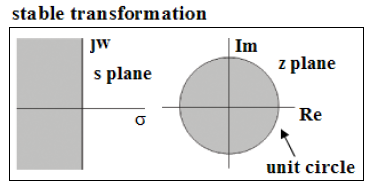

# Theory

The absolute stability and relative stability of the linear time-invariant continuous time closed-loop control system are determined by the location of the closed-loop poles in the S-plane.
For example, complex closed-loop poles in the left half of the S-plane near the j&omega; axis will exhibits oscillatory behavior, and closed-loop poles on the negative real axis will exhibit exponential decay. 
Since the complex variables z and s are related by z = esT , 
the pole and zero locations in the Z-plane are related to the pole and zero locations in the S-plane.
Therefore, the stability of the linear time-invariant discrete-time closed-loop system can be determined in terms of the locations of the poles of the closed-loop pulse transfer function.
It is noted that the dynamic behavior of the discrete-time control system depends on the sampling period T. In other words, a change in the sampling period T modifies the pole and zero locations in the Z-plane and causes the response behavior to change.   
<b>Mapping of the Left Half of the S-plane into the Z-plane</b> 
In the design of a continuous-time control system, the locations of the poles and zeros in the S-plane are very important in predicting the dynamic behavior of the system.
Similarly, in designing discrete-time control systems, the locations of the poles and zeros in the Z-plane are very important. Figure 1 shows the stable region in the s plane and its transformation into the z plane.

 
<b> Fig.1. Mapping the stable region of s plane into z plane </b>

 

When impulse sampling is incorporated into the process, the complex variables z and s are related by the equation:  

$$ z = e^{sT} \tag{1} $$

This means that a pole in the s plane can be located in the z plane through the transformation. 
Since the complex variable s had real part &sigma; and imaginary part &omega;, we have

$$ s = &sigma; + j &omega; \tag{2} $$  

and

$$ z = e^{T(&sigma; +j &omega;)} = e^{T &sigma;} e^{jT &omega;} = e^{T &sigma;} e^{j(T &omega; + 2 &pi;k)} \tag{3} $$

From this last equation we see that poles and zeros in the s plane, where frequencies differ in integral multiples of the sampling frequency 2 &pi;/T
, are mapped into the same location in the z plane.
This means that there are infinitely many values of s for each value of z.  
Since &sigma; is negative in the left half of the s plane, 
the left half of the s plane corresponds to  

$$ |z| = e^{T &sigma;} \lt 1 \tag{4} $$

The j &omega; axis in the s plane corresponding to |z| = 1. 
That is, the imaginary axis in the s plane (the line &sigma; = 0) 
corresponding to the unit circle in the z plane, and the interior of the unit circle corresponds to the left half of the s plane.   

The exponential mapping forms the theoretical basis for several standard methods such as impulse invariance and bilinear transformation used in the conversion of analog systems to digital.
<b>The impulse invariance method</b> directly uses this mapping to transform each pole of the analog system to the digital domain using the relation 
z = esT.
This method preserves the time-domain impulse response of the system but may suffer from aliasing, especially when high-frequency components are present. 
On the other hand, <b>the bilinear transformation</b> uses a rational approximation of the exponential mapping, given by:

$$ z = \frac{1+\frac{sT}{2}}{1-\frac{sT}{2}}  $$

